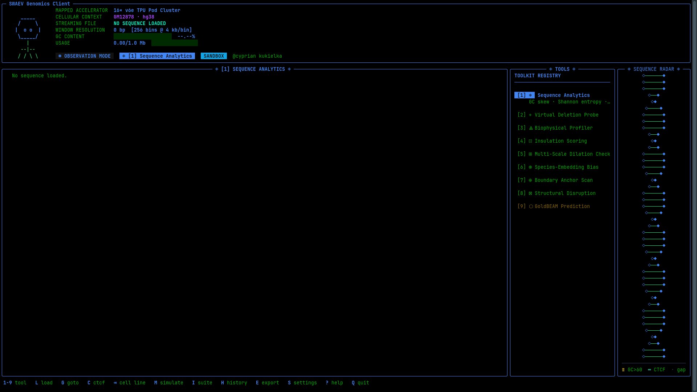

# SWAEV Genomics Terminal User Interface
This repo contains the **SWAEV TUI**, a terminal client for exploring DNA sequences
and 3D chromatin structure: TADs, A/B compartments, insulation, loops, and how variants
change them. For API credentials, visit https://swaev.com/portal.

**[Full documentation](./DOCUMENTATION.md)**: the full tool index, keyboard reference,
file formats, and `curl`/bash/Python recipes for scripting.

> **Status:** the GoldBEAM model is still in training. Contact maps in this build come from a
> *simulated* surrogate and are illustrative only. Tracks computed directly from your DNA
> (GC, entropy, twist, CpG, CTCF motifs) are real. Every export is stamped with a
> `SIMULATED` provenance header.

## Install in Terminal
~~~
curl -fsSL https://raw.githubusercontent.com/CK5515/SWAEV_TUI/main/install.sh | bash
~~~
Requires Python 3.9+ on Linux or macOS (on Windows, use WSL). The installer places the client
in `~/.swaev/`, installs `rich` and `requests`, and adds a `swaev` command to `~/.local/bin`.

## Run in Terminal
~~~
swaev
~~~
On first launch, a short wizard sets your name, theme, language, API key *(optional)* and FASTA
folder. Without a key, you get an offline sandbox profile where every local tool still works.
The client updates itself from GitHub each time it starts.

## Features

### Genomic Flight Simulator
The main screen has three panels: a **HUD workspace**, a **toolkit registry**, and a **Sequence
Radar** (a rotating DNA helix coloured by GC/AT content, with CTCF sites marked). Press `1`–`9`
to switch tools:

| # | Tool | What it does |
|---|---|---|
| 1 | Sequence Analytics | GC skew, Shannon entropy, GC%, Tm, CpG O/E, sequence complexity |
| 2 | Virtual Deletion Probe | In-silico SNPs and deletions, ΔContact map, Structural Disruption Index (SDI) |
| 3 | Biophysical Profiler | Helical twist, DNA bendability, CpG island track |
| 4 | Insulation Scoring | Diamond insulation profile and a ranked TAD boundary table |
| 5 | Multi-Scale Dilation Check | d1/d2/d4/d8 contact-head diagnostics and P(s) decay curve |
| 6 | Species-Embedding Bias | CpG depletion, repeat density, check for mammalian-like DNA |
| 7 | Boundary Anchor Scan | CTCF motif density and predicted loop anchor pairs |
| 8 | Structural Disruption Map | 24-bit colour 40×40 contact matrix with a variant Δ overlay |
| 9 | GoldBEAM Prediction | Model architecture, benchmark target and training status |

### Interpretability Suite (`I`)
Seven analysis tabs: **TAD Architecture · A/B Compartments · Insulation Profile · Loop
Anchor Registry · Sequence Saliency · Variant Modeller · Export Centre**.

### Sequence sources
- **FASTA browser (`L`)**: `.fa`, `.fasta` and `.fna` files from your configured folder, or any path you type.
- **Live UCSC fetch (`G`)**: type a coordinate such as `chr7:114200000-115240000` to pull hg38 sequence in the background.
- **Session history (`H`)**: reload past files and regions, along with their variants and exports.

### Analysis extras
- **Simulation mode (`M`)**: type `snp 500000 G>A`, `del 450000 520000` or `reset` to model variants.
- **CTCF Motif Scanner (`C`)**: finds six structural motifs. Press `⏎` on a hit to send a deletion of that anchor to tool 2.
- **Cell-line context (`Tab`)**: switch between GM12878, H1-hESC and IMR90 chromatin profiles.

### Exports
Files go to `~/goldbeam_exports/`, ready for IGV, the UCSC browser, bedtools and deeptools:
- TAD boundaries and A/B compartments as `.bed`
- Loop anchors as `.tsv`
- Saliency as `.bedGraph`

### Personalisation
- 5 colour themes: Retro Multi Colour, SWAEV Blue (dark or light terminal), SWAEV Lime, Cyberpunk Neon, Retro Amber
- 4 languages: English, Español, Français, Deutsch
- Full-screen, scrollable contextual help (`?`) for every tool and tab

## Keyboard Quick Reference

| Key | Action | Key | Action |
|---|---|---|---|
| `1`–`9` | Switch tool | `M` | Observation ⇄ Simulation mode |
| `L` | Load FASTA | `I` | Interpretability Suite |
| `G` | Fetch UCSC region | `H` | Session history |
| `C` | CTCF motif scanner | `E` | Export active tool |
| `Tab` | Cycle cell line | `S` | Settings (Observation mode only) |
| `?` | Help | `Q` | Quit |

## Files

| Path | Purpose |
|---|---|
| `~/.goldbeam.json` | Settings: API key, theme, language, FASTA folder |
| `~/.goldbeam_history.json` | Session history |
| `~/goldbeam_exports/` | Exported BED, TSV and bedGraph files |
| `~/.swaev/client.py` | The application |

## For Power Users
`swaev` has no command-line flags, but you can script everything around it: check your
quota with `curl`, fetch UCSC regions into FASTA, edit settings with `jq`, and call the
client's analysis functions from Python in batch. See
**[DOCUMENTATION.md § Power users](./DOCUMENTATION.md#12-power-users--scripting-from-the-terminal)**.

```bash
curl -fsS https://gateway.swaev.com/v1/user/usage -H "X-API-Key: $(jq -r .api_key ~/.goldbeam.json)" | jq
```

## Sample Screenshot

